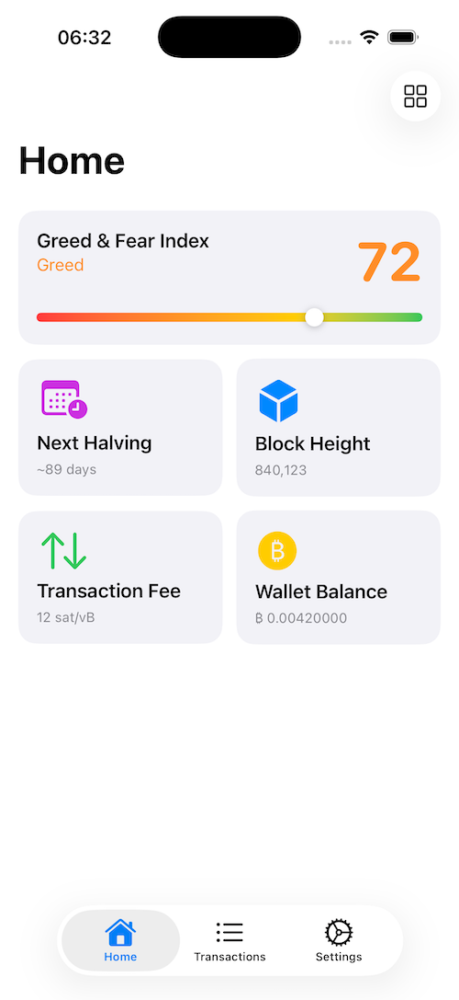
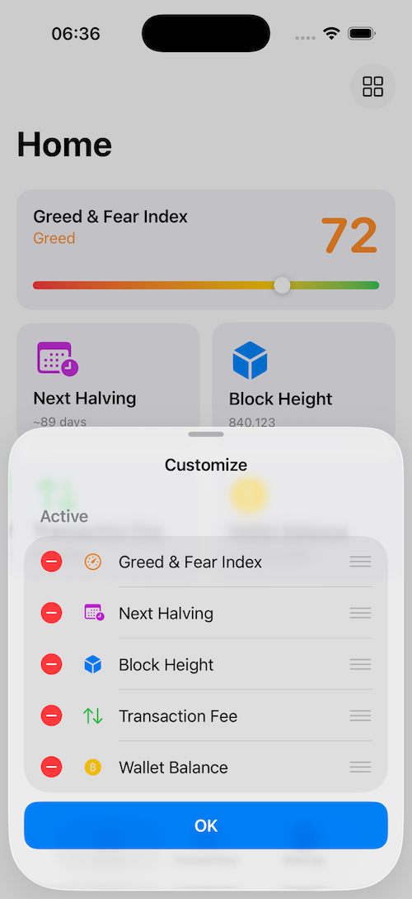
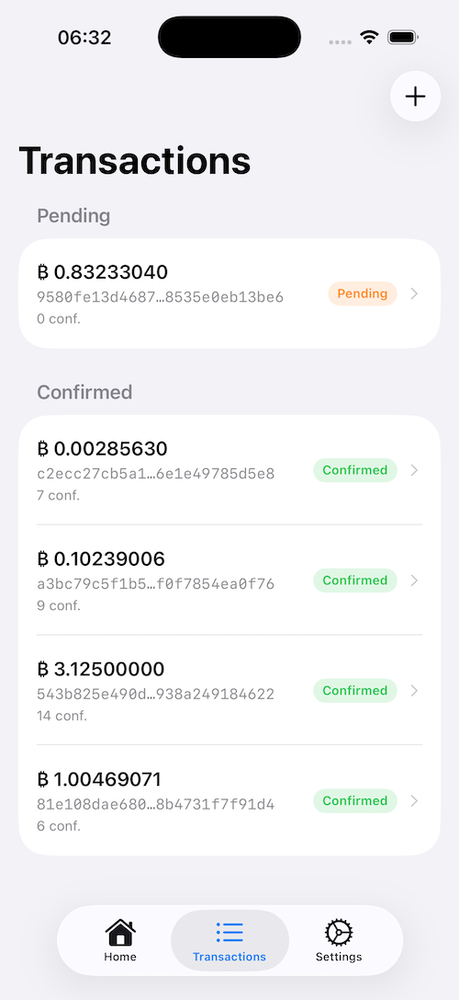
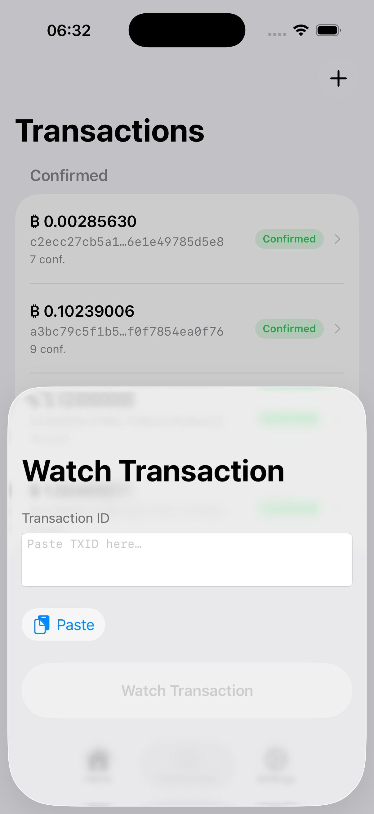
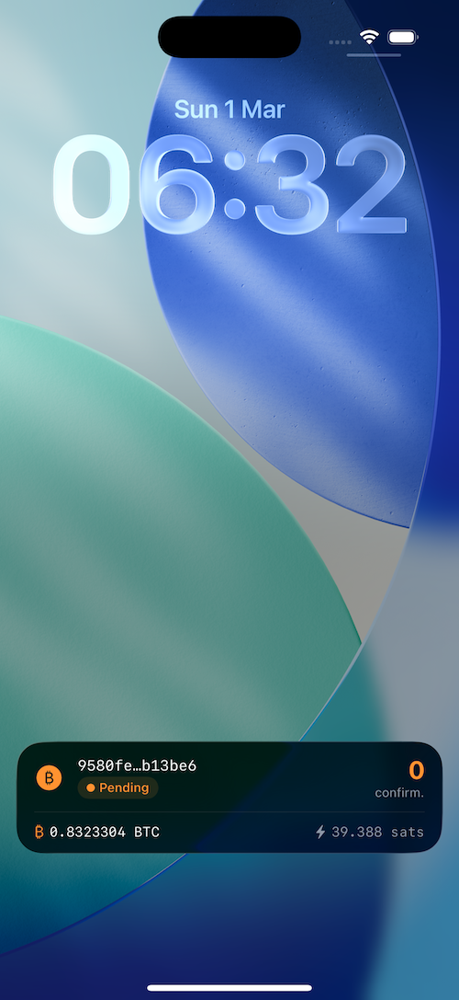

# iOS Mempool Monitor

An iOS app for monitoring Bitcoin transactions in the mempool. Enter a transaction ID and the app starts a **Live Activity** that displays real-time status — confirmations, value, and fee — directly on the Lock Screen and Dynamic Island.

Updates are delivered via **APNs (Apple Push Notification service)**, with no need to keep the connection to the server open.

---

## Screenshots

<p align="center">
  
  
  
  
</p>
<p align="center">
  
</p>

| Screenshot | Description |
|---|---|
| 1 | **Home** — widget grid with Greed & Fear Index (expanded) and compact widgets |
| 2 | **Customize** — reorder, add, and remove widgets via the sheet |
| 3 | **Transactions** — list of monitored transactions grouped by status |
| 4 | **Watch Transaction** — add a new transaction by pasting a TXID |
| 5 | **Live Activity** — real-time transaction status on the Lock Screen |

---

## Requirements

- Xcode 16+
- iPhone running iOS 17+ (Live Activities do not work on the Simulator)
- [XcodeGen](https://github.com/yonatankra/XcodeGen) installed (`brew install xcodegen`)
- **Apple Developer account** with push notifications capability
- **APNs Key** (`.p8`) generated in the Apple Developer Portal — required by the server to send pushes

> Actual monitoring depends on the **[api-mempool-monitor](https://github.com/rubensmachion/api-mempool-monitor)** server, which watches the blockchain and dispatches notifications via APNs.

---

## Quick Start

### 1. Clone the repository

```bash
git clone https://github.com/rubensmachion/ios-mempool-monitor.git
cd ios-mempool-monitor
```

### 2. Set up local configuration

```bash
cp MempoolMonitor/Configs/Local.xcconfig.template MempoolMonitor/Configs/Local.xcconfig
```

Edit `Configs/Local.xcconfig` with your own values:

```
PRODUCT_BUNDLE_IDENTIFIER        = com.yourcompany.mempoolmonitor
PRODUCT_BUNDLE_IDENTIFIER_WIDGET = com.yourcompany.mempoolmonitor.widget
PRODUCT_BUNDLE_IDENTIFIER_TESTS  = com.yourcompany.mempoolmonitor.tests

# api-mempool-monitor server host (without http://)
MEMPOOL_MONITOR_HOST = 192.168.x.x:3000
```

### 3. Generate the Xcode project

```bash
xcodegen generate --spec MempoolMonitor/project.yml
```

### 4. Open in Xcode and run on device

```bash
open MempoolMonitor/MempoolMonitor.xcodeproj
```

Select the **MempoolMonitor** scheme, connect an iPhone, and run with `⌘R`.

---

## Server

For monitoring to work, the **[api-mempool-monitor](https://github.com/rubensmachion/api-mempool-monitor)** server must be running and configured with:

- The **APNs Key** (`.p8`) generated in the Apple Developer Portal
- Your Apple account's **Team ID** and **Key ID**
- Access to the public [mempool.space](https://mempool.space) API

See the server's README for setup instructions.

---

## Running the tests

```bash
xcodebuild test \
  -project MempoolMonitor/MempoolMonitor.xcodeproj \
  -scheme MempoolMonitorTests \
  -destination 'platform=iOS Simulator,name=iPhone 16'
```

Or from Xcode: select the **MempoolMonitor** scheme and press `⌘U`.

